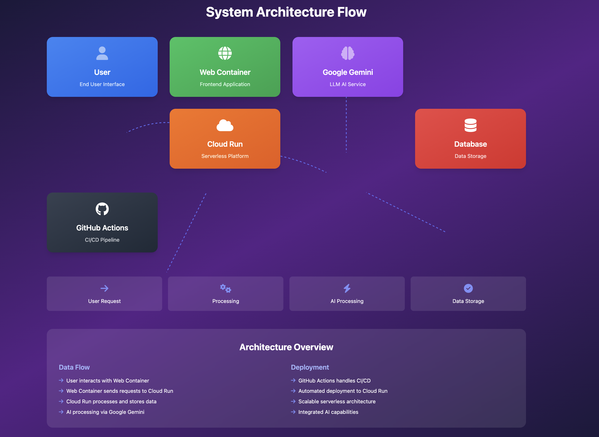

# AI4Boardroom - Your Executive Team, Reimagined with AI

AI4Boardroom empowers startups and enterprises with a virtual team of AI executives—CEO, CFO, COO, CISO, and more—collaborating to drive smarter, faster, and cost-effective decisions.

## Features

* **Upload Documents**: Capture and upload business-related documents via a mobile-friendly web interface.
* **OCR Processing**: Extract text from images and PDFs using Tesseract OCR.
* **AI Executive Review**: Automatically analyze, classify, and route documents through AI agents (e.g., Tax, Legal, Finance).
* **Data Storage**: Persist AI-reviewed outputs in a structured JSON format.
* **Vision Processing**: Leverage Gemini Vision models for receipt analysis and reimbursement insights.
* **Responsive UI**: Optimized for desktop and mobile devices.
* **Secure Login**: Basic user authentication with encoded credentials.

## Architecture

The application follows this architecture:



## Requirements

* **Python 3.x**
* **Packages**:

  * Flask
  * pytesseract
  * Pillow
  * python-dotenv
  * requests
  * google-adk
  * google.generativeai
  * PyPDF2
* **Tesseract OCR** and **Poppler**: Required for image and PDF text extraction.

## Installation

1. **Clone the Repository**

   ```bash
   git clone https://github.com/yourusername/ai4boardroom.git
   cd ai4boardroom
   ```

2. **Create `.env` File**

   ```env
   GOOGLE_API_KEY=your_api_key_here
   PORT=8080
   ```

3. **Install Dependencies**

   ```bash
   pip install -r requirements.txt
   ```

4. **Run the App**

   ```bash
   python app_adk.py
   ```

5. **Access App**

   Navigate to `http://localhost:8080`.

## Test Data

Use [https://expensesreceipt.com/taxi.html](https://expensesreceipt.com/taxi.html) to generate receipts and upload them.

## Deployment

The app is designed to deploy on **Google Cloud Run** with GitHub Actions CI/CD. Secrets like `GOOGLE_API_KEY` and encoded `USERS_JSON` are injected at deploy time.

## License

MIT License
